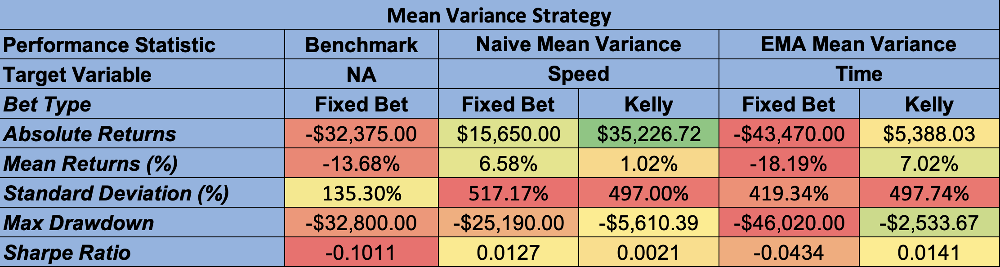
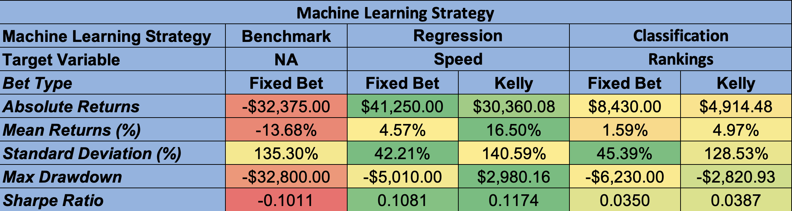
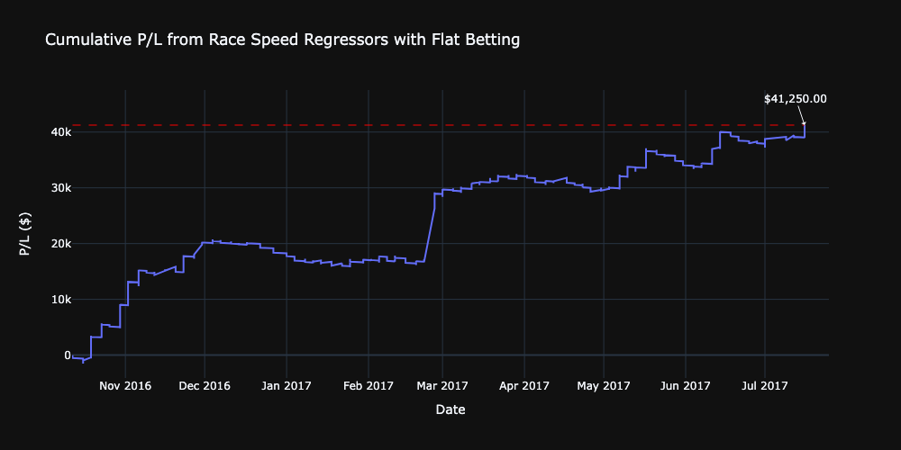
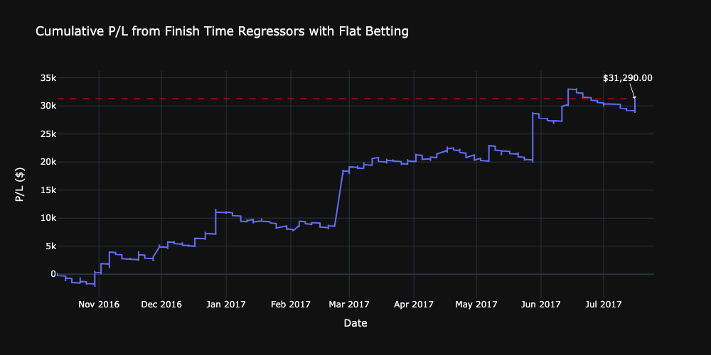
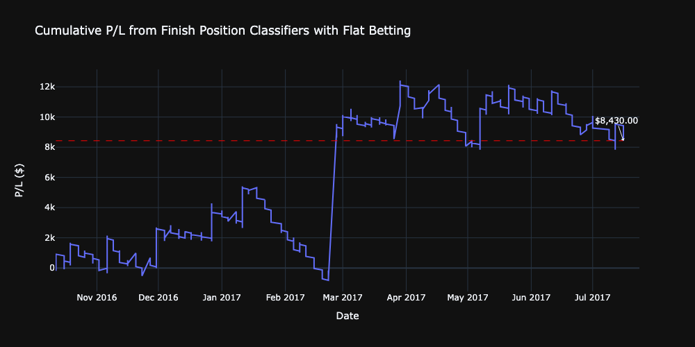
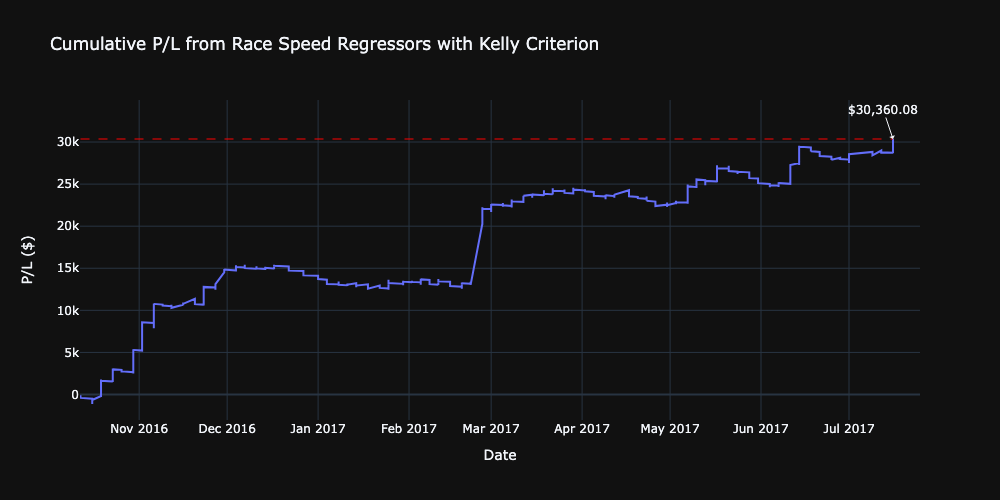
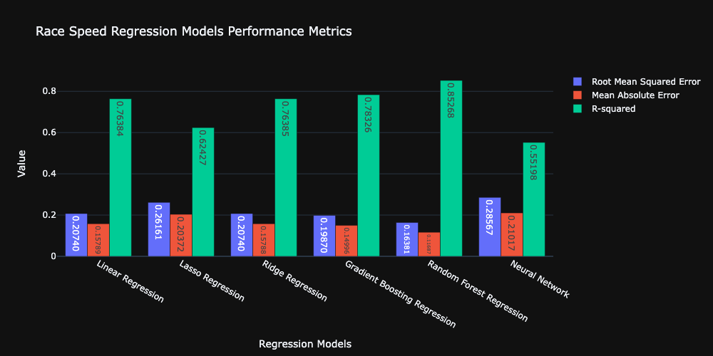
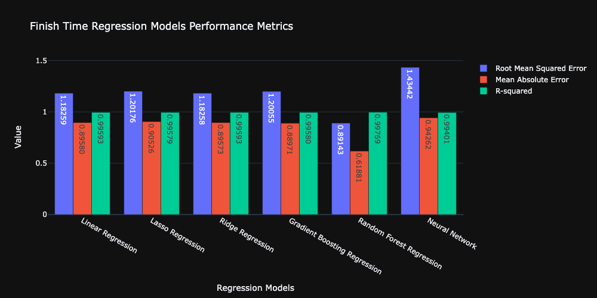
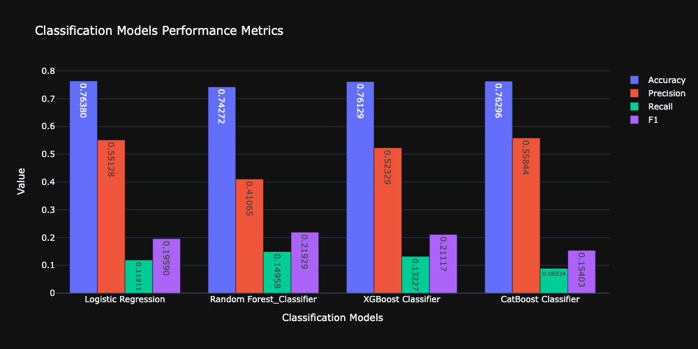

# Investigating Alpha in Horse Racing

## Project Report and Presentation

- [QF206 Project Report](./report/QF206%20G1T3%20-%20Report.pdf)
- [QF206 Project Presentation](./report/QF206%20G1T3%20-%20Slides.pdf)

## About the Project

This project aims to explore potential opportunities in the Hong Kong Horse Race Betting market, utilising data from Hong Kong Jockey Club.

## Results

### Best Performance of each Strategy

- Using a single-bet betting strategy where we only bet the horse with the highest probability of winning in a race, we are able to make substantial profits
- Flat betting yielded the highest absolute profits
- While using Kelly Criterion to perform bet allocation reduced absolute profits, average returns per bet consistently outperformed flat betting across all methods and target variables, except for Naive Mean Variance Strategy.
- Overall, ML models performs the best. The ML models are able to predict the winner of a race more than 50% of the time

## Overview of ML Model Profitability with Betting Strategy

|                              | Race Speed Regressors | Finish Time Regressors | Finishing Position Classifiers |
| :--------------------------: | :-------------------: | :--------------------: | :----------------------------: |
|         Flat Betting         |        $41,250        |        $31,290         |             $8,430             |
| Betting with Kelly Criterion |      $30,360.08       |       $28,419.82       |           $4,914,48            |
|     Prediction Accuracy      |         57.3%         |         55.1%          |             53.9%              |

### Using a Flat Betting Strategy

### Using Kelly Criterion to allocate bet amounts

### Model Training Performance

