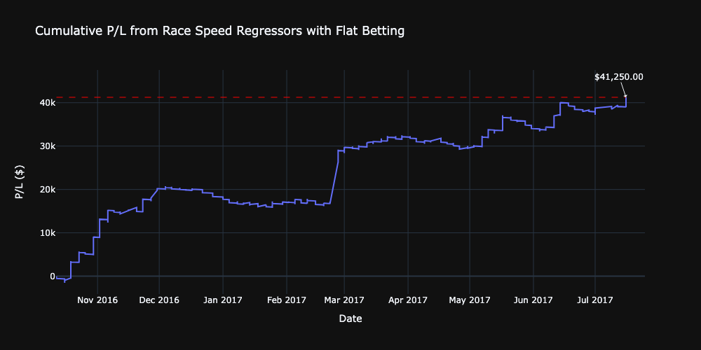
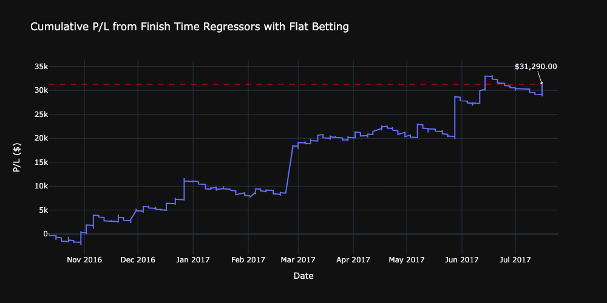
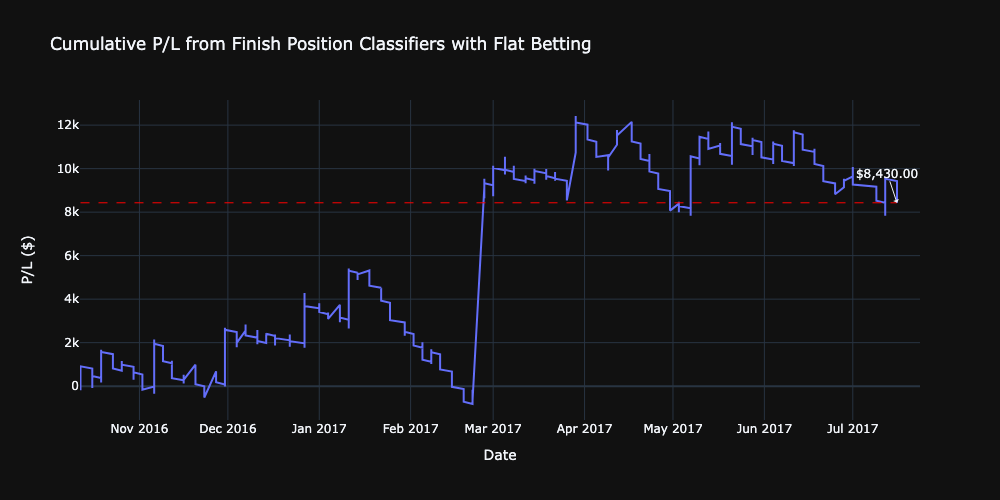
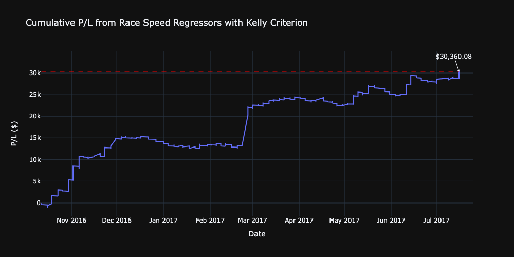
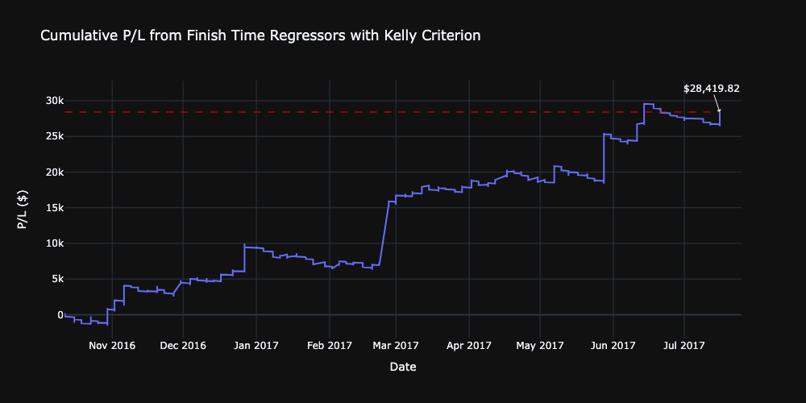
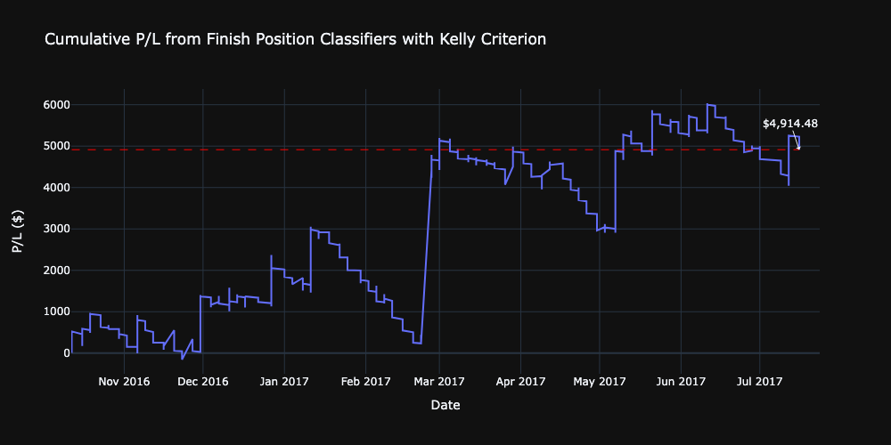

 

  <h2 align="center">Investigating Alpha in Horse Race Betting</h2>
  

    Improving Betting Accuracy and Profitability with Machine Learning
  

 

## About the Project
This project aims to explore potential opportunities in the Hong Kong Horse Race Betting market, utilising data from Hong Kong Jockey Club. 

## Results
* Using a single-bet betting strategy where we only bet the horse with the highest probability of winning in a race, we are able to make substantial profits
* Flat betting yielded the highest absolute profits
* While using Kelly Criterion to perform bet allocation reduced absolute profits, average returns per bet consistently outperformed flat betting across all methods and target variables
* Overall, all models are able to predict the winner of a race more than 50% of the time

### Overview of Model Profitability with Betting Strategy
|      | Race Speed Regressors | Finish Time Regressors | Finishing Position Classifiers |
| :---: | :---: | :---: | :---: |
| Flat Betting | $41,250 | $31,290 | $8,430 |
| Betting with Kelly Criterion | $30,360.08 | $28,419.82 | $4,914,48 |
| Prediction Accuracy | 57.3% | 55.1% | 53.9% |

## Using a Flat Betting Strategy

> Cumulative returns using an ensemble of regressors to predict the average race speed of a horse

> Cumulative returns using an ensemble of regressors to predict the finish time of a horse

> Cumulative returns using an ensemble of classifiers to predict the finishing position of a horse

## Using Kelly Criterion to allocate bet amounts

> Cumulative returns using an ensemble of regressors to predict the average race speed of a horse

> Cumulative returns using an ensemble of regressors to predict the finish time of a horse

> Cumulative returns using an ensemble of classifiers to predict the finishing position of a horse