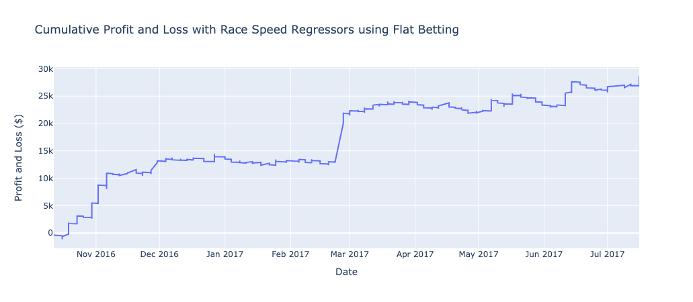
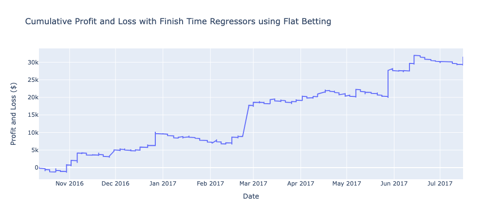
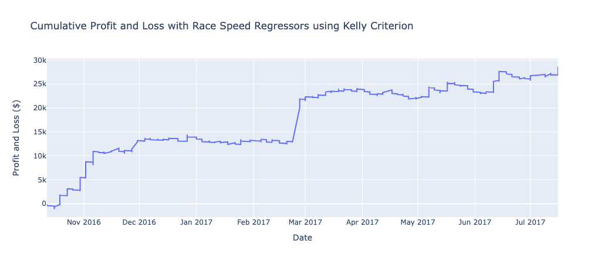
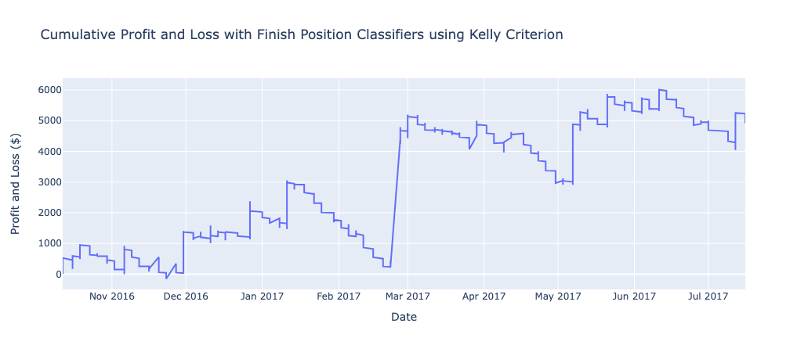

 

  <h2 align="center">Improving Horse Race Betting using Machine Learning</h2>

### Results

- Using a single-bet betting strategy where we only bet the horse with the highest probability of winning in a race, we are able to make substantial profits
- Overall, all models are able to predict the winner of a race more than 50% of the time
  - Average Race Speed Regressors: 57.3% accuracy (Highest Cum Returns)
  - Finish Time Regressors: 55.1% accuracy
  - Finishing Position Classifiers: 53.9% accuracy

### Using a Flat Betting Strategy

> Cumulative returns using an ensemble of regressors to predict the average race speed of a horse

> Cumulative returns using an ensemble of regressors to predict the finish time of a horse

> Cumulative returns using an ensemble of classifiers to predict the finishing position of a horse

### Using Kelly Criterion to allocate bet amounts

> Cumulative returns using an ensemble of regressors to predict the average race speed of a horse

> Cumulative returns using an ensemble of regressors to predict the finish time of a horse

> Cumulative returns using an ensemble of classifiers to predict the finishing position of a horse

## Project Report and Presentation

- [QF206 Project Report](./QF206%20G1T3%20-%20Report.pdf)
- [QF206 Project Presentation](./QF206%20G1T3%20-%20Slides.pdf)
